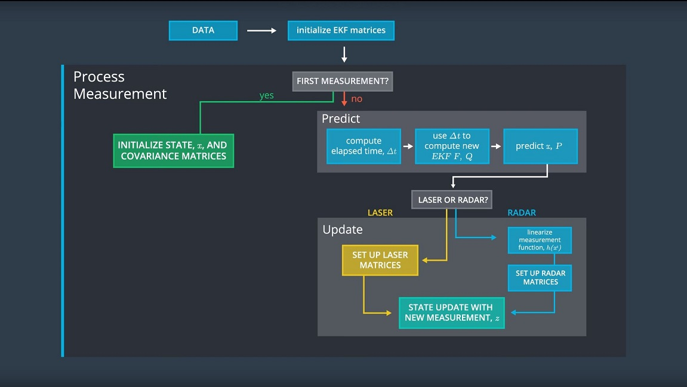
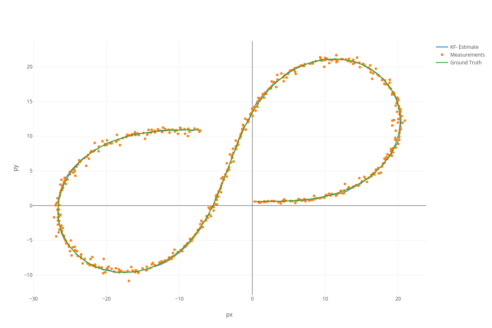
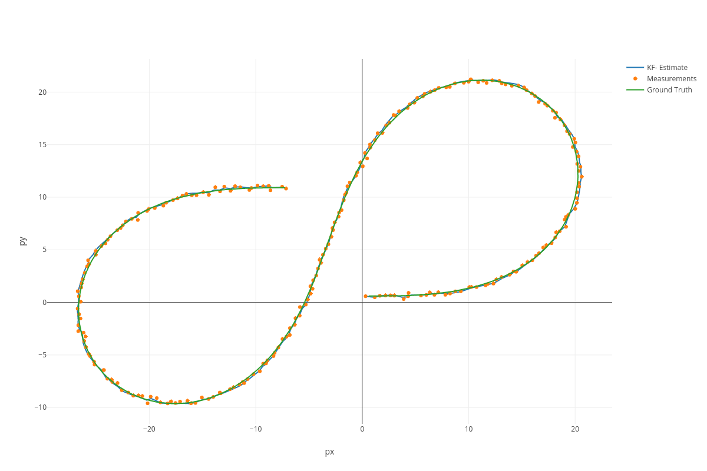
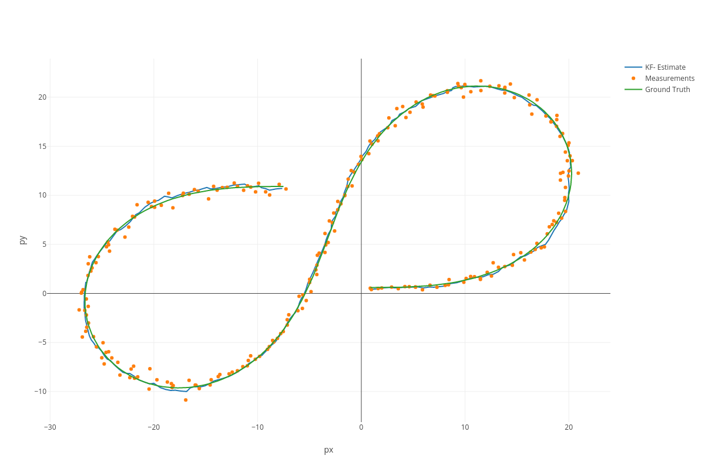

Extended Kalman Filter Project
==============================

Self-Driving Car Engineer Nanodegree Program

Description
-----------

This project implements a sensor fusion algorithm that merges noisy Lidar and
Radar measurements of a moving object of interest from a self driving car
perspective, leveraging on the Extended Kalman Filter tecnique. Measurements
come from a simulator that will show the bicycle real position, the
measurements, the estimates, and the root mean square error of the estimates.
The simulator can be downloaded
[here](https://github.com/udacity/self-driving-car-sim/releases).

The communication with the simulator is based on uWebSocketIO. The repository
includes two files that can be used to set up and install
[uWebSocketIO](https://github.com/uWebSockets/uWebSockets) for either Linux or
Mac systems. For windows you can use either Docker, VMware, or even [Ubuntu bash
on Windows
10](https://www.howtogeek.com/249966/how-to-install-and-use-the-linux-bash-shell-on-windows-10/)
to install uWebSocketIO.

Once the install for uWebSocketIO is complete, the main program can be built and
run by doing the following from the project top directory.

 

1.  mkdir build

2.  cd build

3.  cmake ..

4.  make

5.  ./ExtendedKF

 

Basic Build Instructions
------------------------

1.  Clone this repo.

2.  Make a build directory: `mkdir build && cd build`

3.  Compile: `cmake .. && make`

    -   On windows, you may need to run: `cmake .. -G "Unix Makefiles" && make`

4.  Run it: `./ExtendedKF`

 

Dependencies
------------

-   cmake \>= 3.5

    -   All OSes: [click here for installation
        instructions](https://cmake.org/install/)

-   make \>= 4.1 (Linux, Mac), 3.81 (Windows)

    -   Linux: make is installed by default on most Linux distros

    -   Mac: [install Xcode command line tools to get
        make](https://developer.apple.com/xcode/features/)

    -   Windows: [Click here for installation
        instructions](http://gnuwin32.sourceforge.net/packages/make.htm)

-   gcc/g++ \>= 5.4

    -   Linux: gcc / g++ is installed by default on most Linux distros

    -   Mac: same deal as make - [install Xcode command line
        tools](https://developer.apple.com/xcode/features/)

    -   Windows: recommend using [MinGW](http://www.mingw.org/)

 

Implementation design
---------------------

The overall flow of an EKF algorithm that fuses Lidar and Radar measurements is
the following:

In the `./src/`folder following files are worth of mention:

-   `kalman_filter.h`

    Kalman Filter interface with its 3 methods: `init,predict,update`

    -   `fusion_estimator.cpp`

        Abstract class for a generic estimator that fuses Lidar and Radar
        measurement. Subclasses must implement `GetEstimate(const
        MeasurementPackage &measurement_pack)`but since the RMSE logic is
        indipendent from the implementation of the estimator, the method
        `CalculateRMSE(const vector<VectorXd> &estimations, const
        vector<VectorXd> &ground_truth)` is already implemented here

    -   `fusion_ekf.cpp`

        Extended Kalman Filter that fuses Radar and Lidar. Standard KF equations
        are used for Lidar updates, while EKF with linearization is used for
        Radar updates. Modifying the proper flag in the constructor makes
        possible to exclude one of the two sensors. It implements
        `kalman_filter.h` and inherits `fusion_estimator.h`

    -   `main.cpp`

        Application entry point. Receives via [uWebSocketIO] the sensor
        measurements, calls the estimator and returns to the simulator the
        estimates and the calculated RMSE. Eventually it saves also the results
        in a file

 

This design is a good starting point towards a bridge pattern that hides and
separates the implementation of a generic state (position and velocity)
estimator (EKF, UKF, et others), and its interface. Methods are structured in a
way to follow good object oriented practices to make the code readable and
reusable, without significant overhead.

### Functional programming design challenges

The nature of the Kalman Filter (processing a list of values in a sequential
way, keeping an implicit dependency in its state of all values processed in the
past) suggests that a Functional programming (leveraging for instance on a fold
operation) approach could be natural to implement the algorithm, as illustrated
by John D. Cook
[here](https://www.johndcook.com/blog/2016/07/14/kalman-filters-and-functional-programming/).

However, C++ is not designed as a functional programming language (and
completely far away from a pure functional one like Haskell). In fact C++ 11
supports only a few functional programming constructs
([here](http://blog.madhukaraphatak.com/functional-programming-in-c++/) they
are). To make the language flexible enough to emulate the control flow switch
between the accumulator function (fold) that implements the Kalman and the
function that reads the measurement when they arrive,
[Coroutines](https://www.boost.org/doc/libs/1_67_0/libs/coroutine2/doc/html/index.html)
of the Boost library would be necessary. This would bring massive overhead in
terms of readability and more importantly performance, as a result of forcing an
object oriented language to behave like a functional one.

Besides the limitations of C++, at the moment a functional programming approach
is strongly discouraged given that functional programming languages do not have
spatial and time complexity bounds known in advance given a fixed algorithm,
making them inappropriate for real time systems
([here](https://pdfs.semanticscholar.org/c5ea/0ee9cfd64991d3b2acaa54ec439e9a172b5b.pdf) an
article about the topic).

Estimation results
------------------

After a fine tuning of the initial values to setup the Kalman filter, the final
values for the root mean square error at the end of the simulation are:

`x: 0.0944`

`y: 0.0847`

`Vx: 0.3302`

`Vy: 0.4093`

Leveraging also on these [Visualization
Utilities](https://github.com/udacity/CarND-Mercedes-SF-Utilities) provided by
Mercedes I was able to plot the ground truth values, the sensors measurements
and the estimates for the object position over time:

[Interactive plot](https://plot.ly/~paneand/5/)

Although the measurements are noisy, with the Extended Kalman Filter tecnique is
possible to obtain very accurate estimates and detect the position of the object
with a satisfying precision. In fact the green line (Ground truth) and the blue
one (KF estimate) are almost overlapped most of the time. It is possible to see
that in case of turns, the estimates start to be less precise. This is due to
the fact that the model that describes the object movement used in this project
does not capture turns, but it approximates them with a straight line.

In the constructor of the `fusion_ekf.cpp` is possible to exclude the
measurements coming from Lidar or Radar.

The standard Kalman Filter algorithm only for Lidar, provides these RMSE
results:

`x: 0.1222`

`y: 0.0984`

`Vx: 0.4921`

`Vy: 0.4567`

and this is the resulting plot:

[Interactive plot](https://plot.ly/~paneand/7/)

While using the Extended Kalman Filter equations for the Radar alone, results in
these:

`x: 0.1923`

`y: 0.2798`

`Vx: 0.4489`

`Vy: 0.6534`

And this plot:

[Interactive plot](https://plot.ly/~paneand/1/)

In both cases it is clear that using both Lidar and Radar measurements provides
estimates much more accurate. Since the initial values for EKF state are hard
coded in the constructor of `fusion_ekf.cpp`, a possible further analysis on the
results and sensors capabilities could be to foresee possibility to set up the
initial value of the state, depending on the measurement that comes first. All
the data results and screenshots are stored under `./data/` folder.

 
